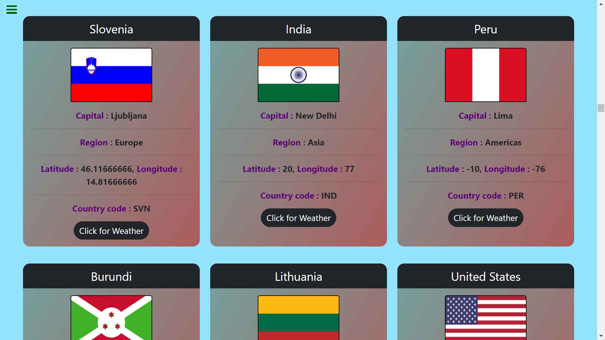
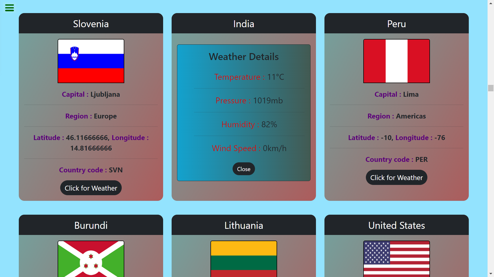

# Day-17 Rest Countries & Weather using fetch API

This project is to create and display the weather details of a country capital using rest countries data and fetch API.

To view the weather app in browser [Click Here](https://weather-3411.netlify.app/)

 

 

